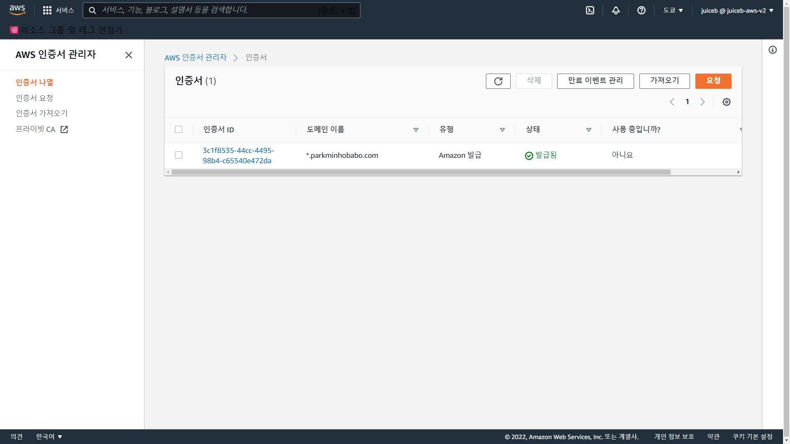
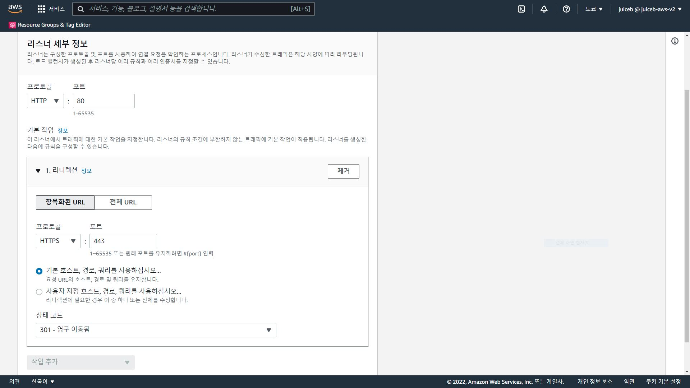

Beanstalk으로 고가용성 Django 웹 애플리케이션 배포하기
=============
---


---
<br/>

### 1. 아키텍쳐
   
   <br/>

   
  
  Beanstalk 콘솔로 고가용성 Django 웹 애플리케이션을 배포해요.

  ap-nothreast-1 도쿄 리전에서 만들었어요.

<br/>
<br/>
<br/>
<br/> 

###  2. Terraform으로 VPC 생성
   <br/>
   
   
<br/> 
  
  VPC 구성도예요.

  terraform 폴더에서 terraform cli로 배포해요.
<br/>
<br/>
<br/>
<br/>

###  3. Django 설정
   <br/>
   
   ```
   devsearch-project/devsearch/setting.py

   line 13-16.
   # Beanstalk URL은 환경 생성 시 '임의 도메인.ap-northeast-1.elasticbeanstalk.com'으로 생성되니 미리 설정해요.
   # ex)test-django-project.ap-northeast-1.elasticbeanstalk.com
   ALLOWED_HOSTS = ['localhost', '127.0.0.1', 'YourBeanstalkDomain.ap-northeast-1.elasticbeanstalk.com', 
   '.YourRoute53Domain.com']

   line 175-182
   # 알림받을 이메일 설정
   # google계정에서 - 보안 수준이 낮은 앱에 대한 액세스 허용
   EMAIL_BACKEND = 'django.core.mail.backends.smtp.EmailBackend'
   EMAIL_HOST = 'smtp.gmail.com'
   EMAIL_PORT = 587
   EMAIL_USE_TLS = True
   EMAIL_HOST_USER = 'YourEmail@gmail.com'
   EMAIL_HOST_PASSWORD = 'YourAppAccessPassword'

   line 202-205
   # StaticFiles의 s3 버킷 경로 설정
   AWS_ACCESS_KEY_ID = 'YourAWSUSerAccessKeyID'
   AWS_SECRET_ACCESS_KEY = 'YourAWSUserAccessKey'
   AWS_STORAGE_BUCKET_NAME = 'YourAWSS3BucketName'
   ```

   settting.py에서 허용 주소, 이메일, staticFiles용 s3버킷을 설정해요.

   ```
   devsearch-project/projects/management/commands/createsu.py

   line 8-9
   # 인스턴스 실행 시 superuser 생성
class Command(BaseCommand):

    def handle(self, *args, **options):
        if not User.objects.filter(username="YourSuperuserUsername").exists():
            User.objects.create_superuser("YourSuperuserUsername", "YourSuperuserEmail", "YourSuperuserPassword")
   ```
   superuser를 설정해요.
   <br/>
   <br/>

   devsearch-project/ 에서 모든 파일을 django.zip으로 압축해요.
<br/>
<br/>
<br/>
<br/>

###  4. Beanstalk 배포

   <br/>
   
   

   

Beanstalk 콘솔에서 환경을 생성해요.
 <br/>
  <br/>

새 환경 생성

웹 서버 환경

애플리케이션 이름 입력

환경 이름 입력

도메인 입력 (devsearch/setting.py에서 ALLOWED_HOSTS에 설정한 값)

플랫폼 설정 Python, Python3.8

애플리케이션 코드 - 코드 업로드 - django.zip

추가 옵션 구성

사전 설정 - 고가용성

용량 - 인스턴스 최소 2 최대 4

로드 밸런스 - ALB

보안 - YourKeyPair

데이터베이스 - 엔진 postgres, 사용자 이름, 암호 설정, 가용성 높음

네트워크
 - vpc('jp-vpc') 
 - 로드밸런서 서브넷 'public-1a-elb', 'public-1c-elb'
 - 인스턴스 서브넷 'private-1a-instance', 'private-1c-instance'
 - 데이터베이스 서브넷 'private-1a-database', 'private-1c-database'

<br/>
<br/>
<br/>
<br/>


###  5. RDS 설정
   <br/>
   
   
   

   RDS를 Django와 연결해요.

   <br/>
   <br/>

   구성 - 소프트웨어 - 환경속성


<br/>
<br/>
<br/>
<br/>


###  6. Route53 설정
   <br/>
   
   
   


Route53에서 도메인에 호스팅해요.
 <br/>
  <br/>

도메인 등록 

등록된 도메인으로 호스팅 영역 생성

레코드 생성 - 단순 레코드 정의 - 레코드 이름 www - 레코드 영역 A -

엔트포인트 Beanstalk 별칭 - 도쿄 리전 - 환경 선택 - 단순 레코드 정의 


<br/>
<br/>
<br/>
<br/>


###  7. Http to Https Redirection

   <br/>
   
   
   

   certificate manager에서 인증서를 요청해요.

   

   구성 - 로드밸런서 - 리스너에 https를 추가해요.

   

   ec2 - 로드밸런서 - 리스너 - 편집에서 http를 https로 리디렉션해요.

<br/>
<br/>
<br/>
<br/>


Beanstalk으로 고가용성 Django 웹 애플리케이션 배포에 성공했어요!!

<br/>
<br/>
<br/>
<br/>

참고 강의

https://www.udemy.com/course/python-django-2021-complete-course/

https://www.udemy.com/course/aws-elastic-beanstalk-master-class/

https://www.udemy.com/course/terraform-on-aws-with-sre-iac-devops-real-world-demos/