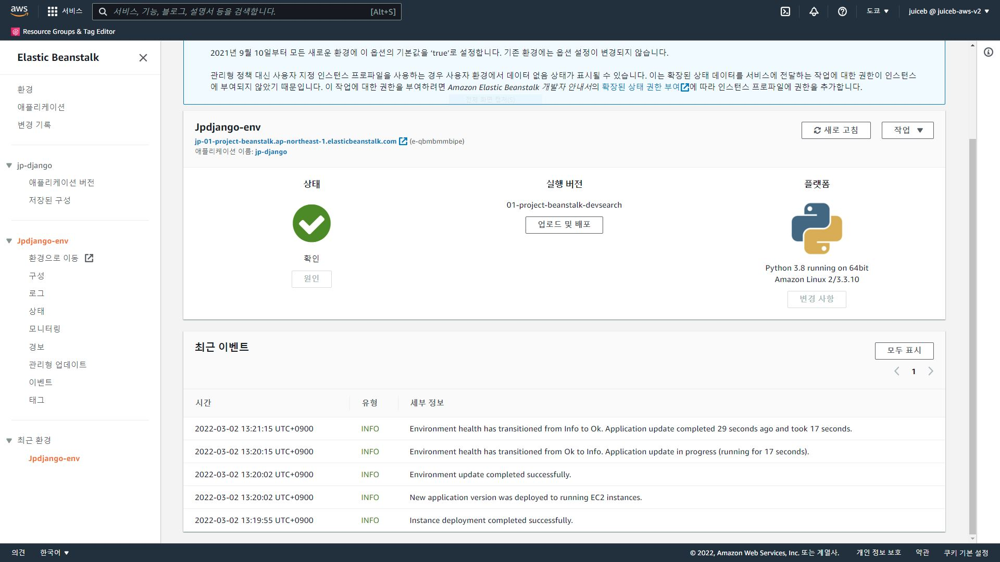
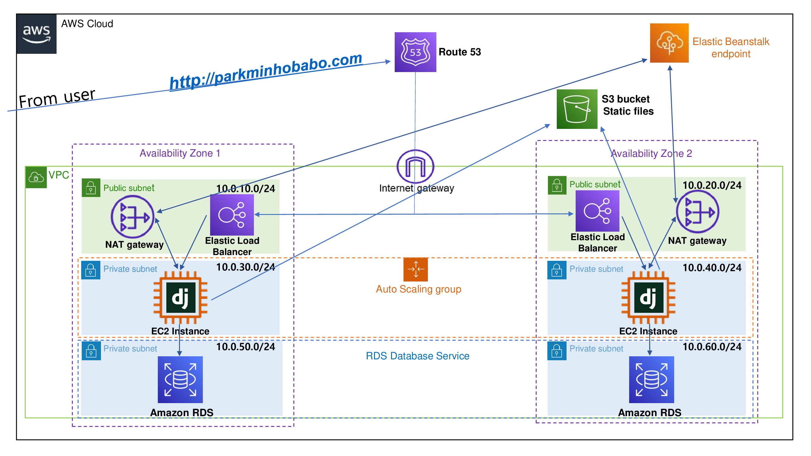
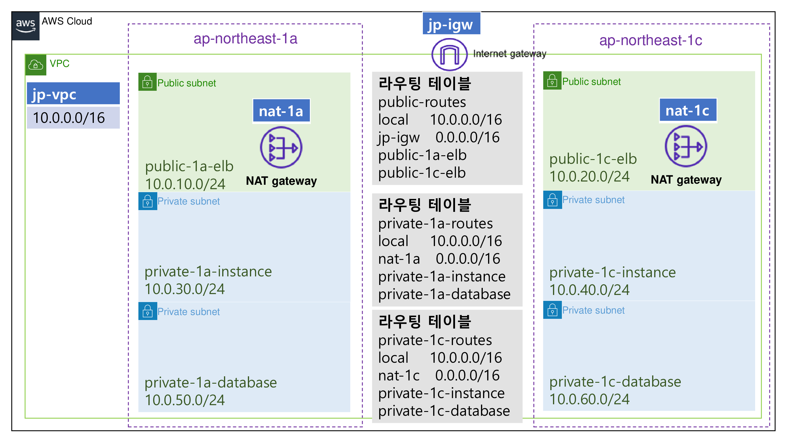
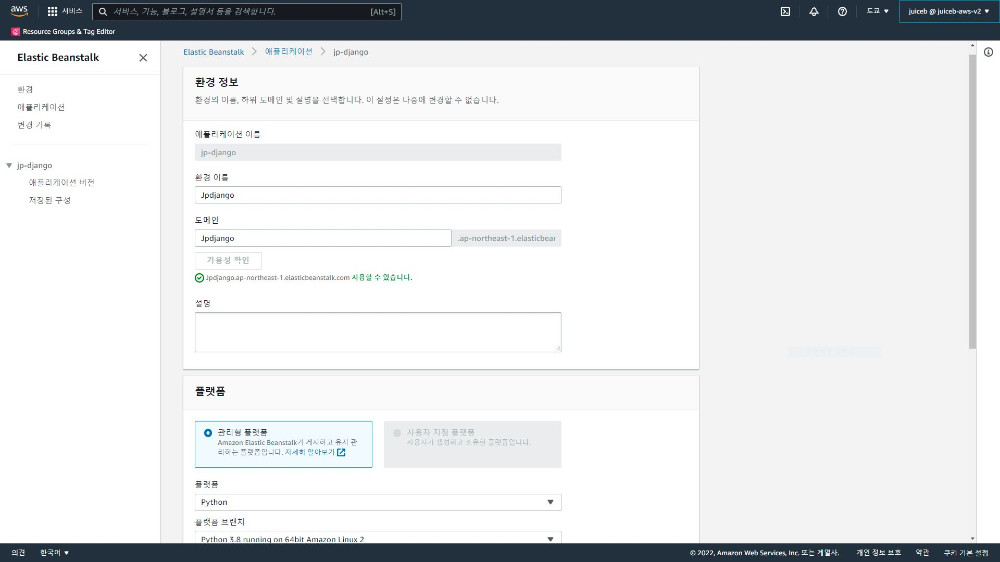
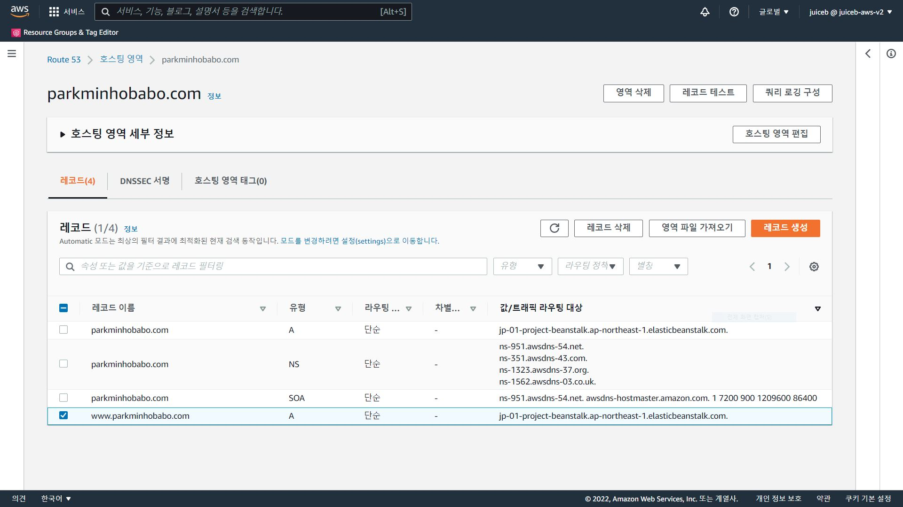

Beanstalk으로 고가용성 Django 웹 애플리케이션 배포하기
=============
---

---
 

### 1. 아키텍쳐
   
    

   
  
  Beanstalk 콘솔을 이용하여 2개의 서브넷에 걸친

  고가용성 Django 웹 애플리케이션을 배포합니다.

  ap-nothreast-1 도쿄 리전으로 만들었습니다.

 
 
 
  

###  2. Terraform으로 VPC 생성
    
   
   
  
  
  위는 VPC 구성도입니다.

  terraform/ 에서 terraform cli로 배포합니다.
 
 
 
 

###  3. Django 설정
    
   
   

   devsearch-project/devsearch/setting.py 에서 지시사항에 따라 수정합니다.

   line 16. - 허용 주소 설정

   line 181-182. - 이메일 설정

   line 203-205. - statcic image용 S3 버킷 설정

   devsearch-project/management/commands/createsu.py

   line 8-9. - superuser 설정

   devsearch-project/ 에서 모든 파일을 django.zip으로 압축합니다.
 
 
 
 

###  4. Beanstalk 배포
    
   
   

Beanstalk 콘솔에서 환경을 생성합니다.

새 환경 생성

웹 서버 환경

애플리케이션 이름 입력

환경이름 입력

도메인 입력 (devsearch/setting.py내 ALLOWED_HOSTS에 설정한 값)

플랫폼 설정 Python, Python3.8

애플리케이션 코드 - 코드 업로드 - django.zip

추가 옵션 구성

사전 설정 - 고가용성

용량 - 인스턴스 최소2 최대4

로드 밸런스 - ALB

보안 - YourKeyPair

데이터베이스 - 엔진 postgres, 사용자 이름, 암호 설정, 고가용성

네트워크
 - vpc('jp-vpc') 
 - 로드밸런서 서브넷 'public-1a-elb', 'public-1c-elb'
 - 인스턴스 서브넷 'private-1a-instance', 'private-1c-instance'
 - 데이터베이스 서브넷 'private-1a-database', 'private-1c-database'
 
 
 
 

###  5. Route53 호스팅
    
   
   

Route53에서 원하는 도메인에 호스팅합니다.

도메인 등록 

등록된 도메인으로 호스팅 영역 생성

레코드 생성 - 단순 레코드 정의 - 레코드 이름 www - 레코드 영역 A -

엔트포인트 Beanstalk 별칭 - 도쿄 리전 - 환경 선택 - 단순 레코드 정의 

 
 
 
 

###  5. Http to https redirection
    
   
   

작성중입니다.