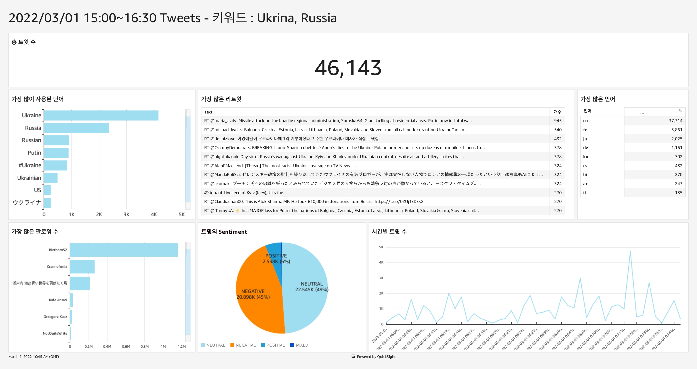
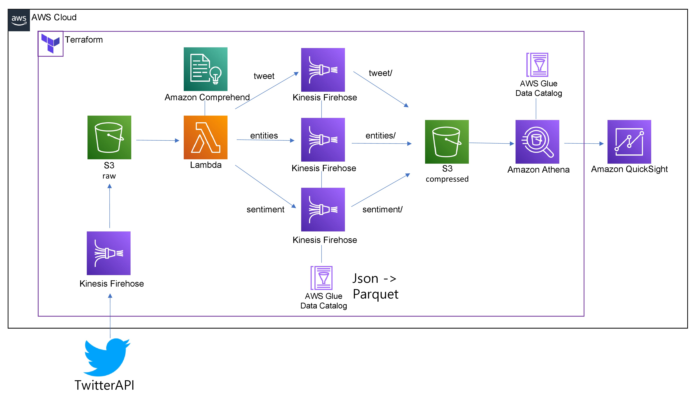
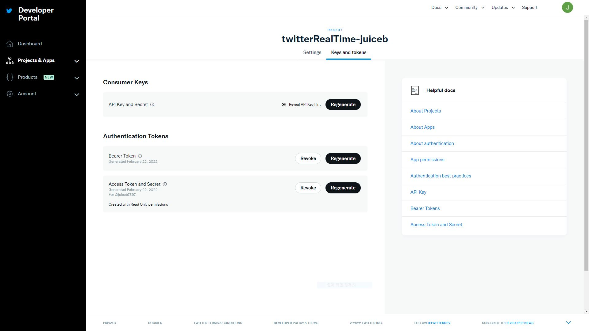
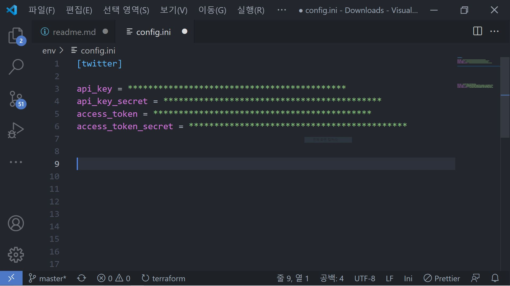
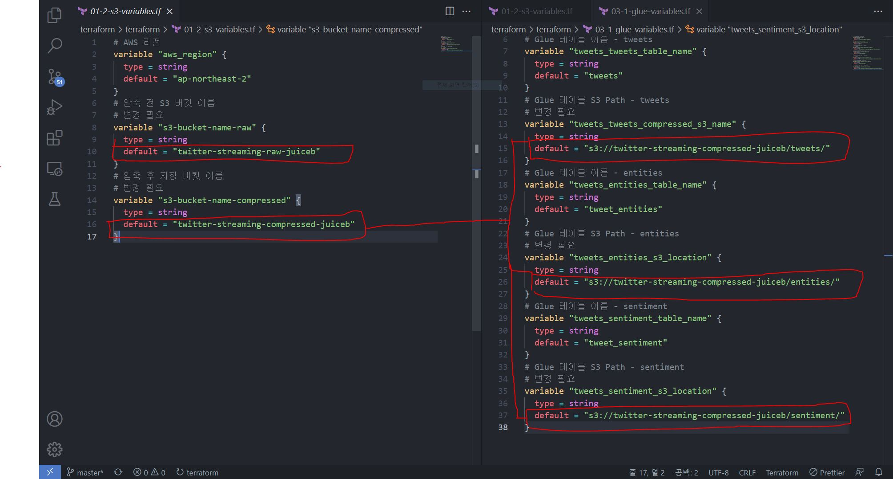
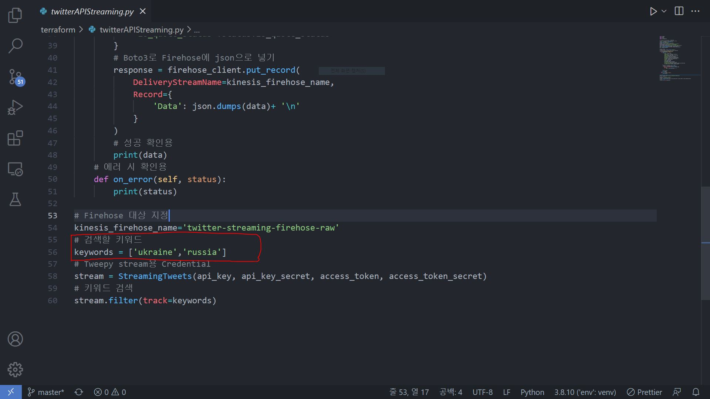
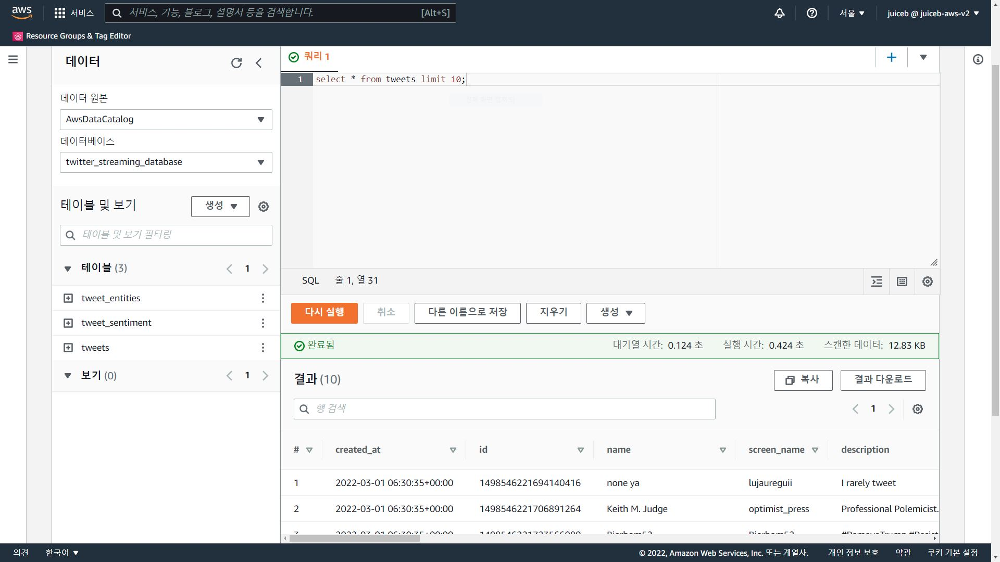
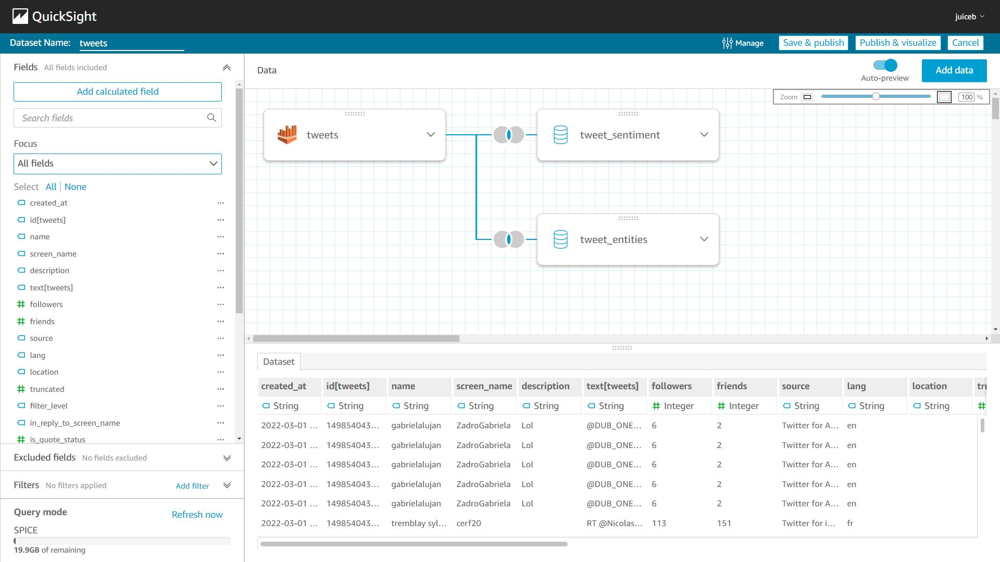

Twitter Streaming 데이터를 분석하고 시각화 하기
=============
---

---
 
1. 아키텍쳐
   
    

   

   트위터 API로 실시간 데이터를 읽어들입니다.

   Firehose를 통해 데이터를 S3 버킷에 저장합니다.

   S3 버킷 ObjectCreated 트리거가 적용된 Lambda로 데이터를 가져옵니다. Comprehend API로 구문을 분석 후 각각 Firehose로 보냅니다.

   Lambda에서 받은 'entities', 'sentiment', 'tweets' 데이터를 Glue Table을 지정하여
   Parquet형태로 변환 후 Snappy로 압축합니다. 그런 다음 접두사된 폴더로 S3 버킷에 보냅니다.

   S3에 저장된 데이터를 Athena로 쿼리합니다.

   Athena에 저장된 테이블로 Quicksight 데이터셋을 만든 뒤 원하는 형태로 시각화합니다.

   TwitterAPI와 Quicksight 제외 전부 Terraform으로 구현합니다.
 
 
 
 
1. TwitterAPI용 Credential 생성
   
   
 
  
https://developer.twitter.com/en Twitter Developer에서 회원가입을 합니다.
  
  Developer Portal에서 APP을 만든 뒤 위와 같은 Consumer Key와 Authentication Tokens를 생성합니다.
 
 

  

config.ini 파일에 입력 후 저장합니다.
 
 
 
 
3. terraform 배포
   
  

  배포 전 몇 가지 변수 값을 설정합니다.
  
  01-2-s3-variables.tf 에서 위에 표시된 default 값을 변경합니다. 유니크한 s3 버킷 이름을 입력합니다.

  03-1-glue-variables.tf 에서 앞서 입력한 s3버킷 이름에 맞춰 default 값을 변경합니다. 

   그런 다음 terraform cli로 배포합니다.
 
 
 
 
4. TwitterAPI 실행
   
   

   twitterAPIStreaming.py 내 검색할 keywords 설정 후 실행

   (Python3.8 사용, Library는 requirements.txt 참고)
 
 
 
 
5. Athena에서 쿼리
   
   

  (Firehose 기본 버퍼 5분으로 설정되어 있습니다.)

  S3 버킷에 데이터가 들어오면 AWS Athena에서 쿼리 저장용 버킷을 설정합니다.

  데이터베이스를 선택 후 원하는 쿼리를 실행합니다.

  (파티셔닝을 원할 경우 Glue Crawler를 사용합니다.)
 
 
 
 
6. Quicksight에서 시각화
   
   

   Source로 Athena를 선택한 뒤 데이터셋을 만듭니다.

   모든 필드를 합친 뒤 생성합니다.

   우리 마음대로 대쉬보드를 꾸며봅시다!

 

   

인사이트를 얻어봅시다!
 
 