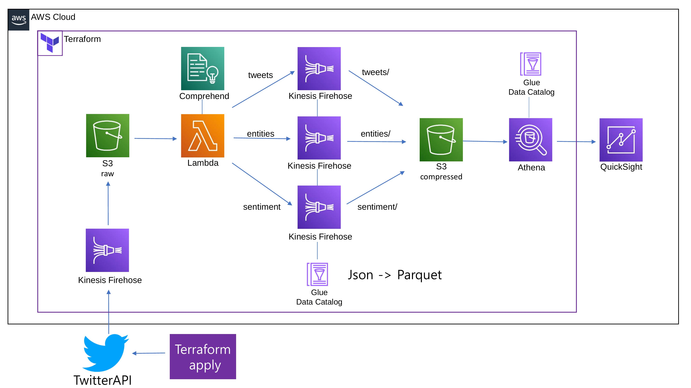

Twitter Streaming 데이터를 분석하고 시각화 하기
=============
---


---
<br/>

### 1. 아키텍쳐
   
   <br/>

   

   Terraform으로 파이프라인을 구축해요.

   트위터 API로 실시간 데이터를 가져와요.

   Firehose를 통해 S3 버킷에 저장해요.

   S3 트리거로 Lambda를 실행해요.
   
   S3 버킷에서 데이터를 가져오고 Comprehend API로 구문을 분석해요.
   
   분석된 'entities', 'sentiment', raw 데이터에서 추출한 'tweets'를 Firehose로 보내요.

   받은 데이터를 Glue Table을 지정하고 Parquet으로 변환 후 Snappy로 압축해요. 
   
   'tweets/', 'entities/', 'sentiment/' 접두사 폴더로 S3 버킷에 보내요.

   S3에 저장된 데이터를 Athena로 쿼리해요.

    Quicksight에서 Athena에 저장된 테이블로 데이터셋을 만든 뒤 원하는 형태로 시각화해요.

<br/>
<br/>
<br/>
<br/> 

###  2. Terraform 배포

   sample
   <br/>
   
   ```
   terraform/03-3-glue-createTables.tf

   # Glue 테이블 - tweets
resource "aws_glue_catalog_table" "twitter_stream_tweets_table" {
  name          = var.tweets_tweets_table_name
  database_name = "${aws_glue_catalog_database.twitter_streaming_database.name}"

  table_type = "EXTERNAL_TABLE"

  parameters = {
    EXTERNAL         = "TRUE"
    "classification" = "parquet"
  }

# 테이블 속성
  storage_descriptor {
    location      = var.tweets_tweets_compressed_s3_name
    input_format  = "org.apache.hadoop.hive.ql.io.parquet.MapredParquetInputFormat"
    output_format = "org.apache.hadoop.hive.ql.io.parquet.MapredParquetOutputFormat"

    ser_de_info {
      serialization_library = "org.apache.hadoop.hive.ql.io.parquet.serde.ParquetHiveSerDe"

      parameters = {
        "serialization.format" = 1
      }
    }
# 테이블 스키마 - tweets
    columns {
      name = "created_at"
      type = "string"
    }
    columns {
      name = "text"
      type = "string"
    }
    columns {
      name    = "name"
      type    = "string"
    }
    columns {
      name    = "screen_name"
      type    = "string"
    }
    columns {
      name    = "description"
      type    = "string"
    }
    columns {
      name    = "id"
      type    = "string"
    }
    columns {
      name    = "followers"
      type    = "bigint"
    }
    columns {
      name    = "friends"
      type    = "bigint"
    }
    columns {
      name    = "source"
      type    = "string"
    }
    columns {
      name    = "lang"
      type    = "string"
    }
    columns {
      name    = "location"
      type    = "string"
    }
    columns {
      name    = "truncated"
      type    = "boolean"
    }
    columns {
      name    = "filter_level"
      type    = "string"
    }
    columns {
      name    = "in_reply_to_screen_name"
      type    = "string"
    }
    columns {
      name    = "is_quote_status"
      type    = "boolean"
    }
  }
}

# Glue 테이블 - entities
resource "aws_glue_catalog_table" "twitter_stream_entities_table" {
  name          = var.tweets_entities_table_name
  database_name = "${aws_glue_catalog_database.twitter_streaming_database.name}"

  table_type = "EXTERNAL_TABLE"

  parameters = {
    EXTERNAL         = "TRUE"
    "classification" = "parquet"
  }

# 테이블 속성
  storage_descriptor {
    location      = var.tweets_entities_s3_location
    input_format  = "org.apache.hadoop.hive.ql.io.parquet.MapredParquetInputFormat"
    output_format = "org.apache.hadoop.hive.ql.io.parquet.MapredParquetOutputFormat"

    ser_de_info {
      name                  = "tweitter-stream-entities"
      serialization_library = "org.apache.hadoop.hive.ql.io.parquet.serde.ParquetHiveSerDe"

      parameters = {
        "serialization.format" = 1
      }
    }
# 테이블 스키마 - entities
    columns {
      name = "id"
      type = "string"
    }
    columns {
      name    = "entity"
      type    = "string"
    }
    columns {
      name    = "type"
      type    = "string"
    }
    columns {
      name    = "score"
      type    = "double"
    }
  }
}


# Glue 테이블 - sentiment
resource "aws_glue_catalog_table" "twitter_stream_sentiment_table" {
  name          = var.tweets_sentiment_table_name
  database_name = "${aws_glue_catalog_database.twitter_streaming_database.name}"

  table_type = "EXTERNAL_TABLE"

  parameters = {
    EXTERNAL         = "TRUE"
    "classification" = "parquet"
  }

# 테이블 속성
  storage_descriptor {
    location      = var.tweets_sentiment_s3_location
    input_format  = "org.apache.hadoop.hive.ql.io.parquet.MapredParquetInputFormat"
    output_format = "org.apache.hadoop.hive.ql.io.parquet.MapredParquetOutputFormat"

    ser_de_info {
      name                  = "tweitter-stream-entities"
      serialization_library = "org.apache.hadoop.hive.ql.io.parquet.serde.ParquetHiveSerDe"

      parameters = {
        "serialization.format" = 1
      }
    }
# 테이블 스키마 - sentiment
    columns {
      name = "id"
      type = "string"
    }
    columns {
      name    = "text"
      type    = "string"
    }
    columns {
      name    = "sentiment"
      type    = "string"
    }
    columns {
      name    = "sentiment_pos_score"
      type    = "double"
    }
    columns {
      name    = "sentiment_neg_score"
      type    = "double"
    }
    columns {
      name    = "sentiment_neu_score"
      type    = "double"
    }
    columns {
      name    = "sentiment_mixed_score"
      type    = "double"
    }
  }
}
   ```

   terraform 폴더에서 terraform cli로 배포해요.

<br/>
<br/>
<br/>
<br/>

###  3. TwitterAPI용 Credential 생성

   <br/>
   
   

<br/>
  
https://developer.twitter.com/en 

Twitter Developer에서 회원가입을 해요.
  
  Developer Portal에서 APP을 만든 뒤 위와 같은 Consumer Key와 Authentication Tokens를 생성해요.
<br/>
<br/>

  

config.ini 파일에 입력 후 저장해요.
<br/>
<br/>
<br/>
<br/>

###  4. TwitterAPI 실행
   <br/>

   ```
   twitterAPIStreaming.py

   import tweepy
import boto3
import json
import configparser

# config.ini 파일에 입력한 credential
config = configparser.ConfigParser()
config.read('config.ini')
api_key = config['twitter']['api_key']
api_key_secret = config['twitter']['api_key_secret']
access_token=config['twitter']['access_token']
access_token_secret=config['twitter']['access_token_secret']
auth = tweepy.OAuthHandler(api_key, api_key_secret)
auth.set_access_token(access_token, access_token_secret)
api = tweepy.API(auth)

# Boto3 client
firehose_client = boto3.client('firehose')
# Tweepy Stream으로 Tweepy Status Object 가져오기
class StreamingTweets(tweepy.Stream):
    def on_status(self, status):
        data = {
            "text": status.text,
            "created_at": str(status.created_at),
            "name": status.user.name,
            "screen_name":status.user.screen_name,
            "location":status.user.location,
            "description":status.user.description,
            "followers":status.user.followers_count,
            "friends":status.user.friends_count,
            "source": status.source,
            "lang":status.lang,
            "id":status.id_str,
            "truncated":status.truncated,
            "filter_level":status.filter_level,
            "in_reply_to_screen_name":status.in_reply_to_screen_name,
            "is_quote_status":status.is_quote_status
        }
        # Boto3로 Firehose에 json으로 넣기
        response = firehose_client.put_record(
            DeliveryStreamName=kinesis_firehose_name,
            Record={
                'Data': json.dumps(data)+ '\n'
            }
        )
        # 성공 확인용
        print(data)
    # 에러 시 확인용
    def on_error(self, status):
        print(status)

# Firehose 대상 지정
kinesis_firehose_name='twitter-streaming-firehose-raw'
# 검색할 키워드
keywords = ['ukraine','russia']
# Tweepy stream용 Credential
stream = StreamingTweets(api_key, api_key_secret, access_token, access_token_secret)
# 키워드 검색
stream.filter(track=keywords)
   ```

   검색할 키워드를 설정하고 실행해요.
   
   ```
   terraform/lambda/lambda_function.py

   import json
import boto3
import os
import re

# Boto3 s3.Object용 resource
s3 = boto3.resource('s3')
# Boto3 Comprehend, Fireghose client
comprehend = boto3.client('comprehend')
firehose = boto3.client('firehose')
# 엔티티용 정규표현식 digit, #, @ 시작-종료
entity_should_be_filtered = re.compile('^[\d#@]$')
# 람다 핸들러
def lambda_handler(event, context):
    print(event)
    # 람다 핸들러 Records에 트리거 된 s3버킷 이름과 파일이름 갖고오기
    for record in event['Records']:
        s3_bucket = record['s3']['bucket']['name']
        s3_key = record['s3']['object']['key']
        obj = s3.Object(s3_bucket, s3_key)
        # 'Body'값을 read로 읽고 bytes 반환, utf-8로 디코드 후 str 반환
        tweets_as_string = obj.get()['Body'].read().decode('utf-8') 
        #'\n'으로 분리된 걸 ','로 치환, list 반환
        tweets = tweets_as_string.split('\n')
        
        for tweet_string in tweets:
            if len(tweet_string) < 1:
                continue
            # list된 걸 json형식의 dic으로 반환
            tweet = json.loads(tweet_string)
            # 가져올 데이터 - tweets
            tweets_record = {
            "text": tweet['text'],
            "created_at": tweet['created_at'],
            "name": tweet['name'],
            "screen_name":tweet['screen_name'],
            "location":tweet['location'],
            "description":tweet['description'],
            "followers":tweet['followers'],
            "friends":tweet['friends'],
            "source": tweet['source'],
            "lang":tweet['lang'],
            "id":tweet['id'],
            "truncated":tweet['truncated'],
            "filter_level":tweet['filter_level'],
            "in_reply_to_screen_name":tweet['in_reply_to_screen_name'],
            "is_quote_status":tweet['is_quote_status']
            }
            # Boto3 Firehose 대상 지정 - tweets
            firehose.put_record(
                DeliveryStreamName=os.environ['TWEETS_STREAM'],
                Record={
                    # dic을 json형식의 str로 변환 후 저장
                    'Data': json.dumps(tweets_record) + '\n'
                }
            )
            # Cloudwatch Log 확인용
            print(tweets_record)
            # Boto3 Comprehend - detect_sentiment 요청 구문
            sentiment_response = comprehend.detect_sentiment(
                Text=tweet['text'],
                LanguageCode=tweet['lang']
                )
            
            # 가져올 데이터 - sentiment return 값
            sentiment_record = {
                'id': tweet['id'],
                'text': tweet['text'],
                'sentiment': sentiment_response['Sentiment'],
                'sentiment_pos_score': sentiment_response['SentimentScore']['Positive'],
                'sentiment_neg_score': sentiment_response['SentimentScore']['Negative'],
                'sentiment_neu_score': sentiment_response['SentimentScore']['Neutral'],
                'sentiment_mixed_score': sentiment_response['SentimentScore']['Mixed']
            }
            # Boto3 Firehose 대상 지정 - sentiment
            firehose.put_record(
                DeliveryStreamName=os.environ['SENTIMENT_STREAM'],
                Record={
                    # dic을 json형식의 str로 변환 후 저장
                    'Data': json.dumps(sentiment_record) + '\n'
                }
            )
            # Cloudwatch Log 확인용
            print(sentiment_response)
            # detect_entities 요청 구문
            entities_response = comprehend.detect_entities(
                    Text=tweet['text'],
                    LanguageCode=tweet['lang']
                )
             # Cloudwatch Log 확인용
            print(entities_response)
            # 가져올 데이터 - detect_entities return 값
            seen_entities = []
            for entity in entities_response['Entities']:
                # 숫자0-9,#,@ 1글자 엔티티 제외
                if (entity_should_be_filtered.match(entity['Text'])):
                    continue
                # 중복 제거
                id = entity['Text'] + '-' + entity['Type']
                if (id in seen_entities) == False:
                    entity_record = {
                        'id': tweet['id'],
                        'entity': entity['Text'],
                        'type': entity['Type'],
                        'score': entity['Score']
                    }
                    seen_entities.append(id)
                    # Boto3 Firehose 대상 지정 - entities
                    firehose.put_record(
                        DeliveryStreamName=os.environ['ENTITY_STREAM'],
                        Record={
                            # dic을 json형식의 str로 변환 후 저장
                            'Data': json.dumps(entity_record) + '\n'
                        }
                    )

    return 'true'
   ```

   TwitterAPI에서 보낸 데이터를 Firehose를 통해 S3_raw 버킷에 저장해요.

   S3_raw 버킷에 데이터가 저장되면 위의 lambda 함수가 트리거돼요.


<br/>
<br/>
<br/>
<br/>

###  5. Athena에서 쿼리
   <br/>
   
   

  데이터베이스 선택 후 원하는 쿼리를 실행해요.

  파티셔닝을 원할 경우 Glue Crawler를 사용해요.

<br/>
<br/>
<br/>
<br/>

###  6. Quicksight에서 시각화
   <br/>
   
   

   Source로 Athena를 선택한 뒤 데이터셋을 만들어요.

   모든 필드를 합친 뒤 게시해요.

<br/>

   

우리 마음대로 대쉬보드를 꾸며봐요!

인사이트를 얻어 봐요!

<br/>
<br/>
<br/>
<br/>

참고 강의

https://www.udemy.com/course/tweepy-twitter-python/

https://www.udemy.com/course/mastering-boto3-with-aws-services/

https://www.udemy.com/course/aws-data-analytics/

https://www.udemy.com/course/data-engineering-using-aws-analytics-services/

참고 사이트

https://dwbi.org/pages/236
  
https://aws.amazon.com/jp/builders-flash/202009/twitter-timeline-analysis/

그 외 공식 Documentation