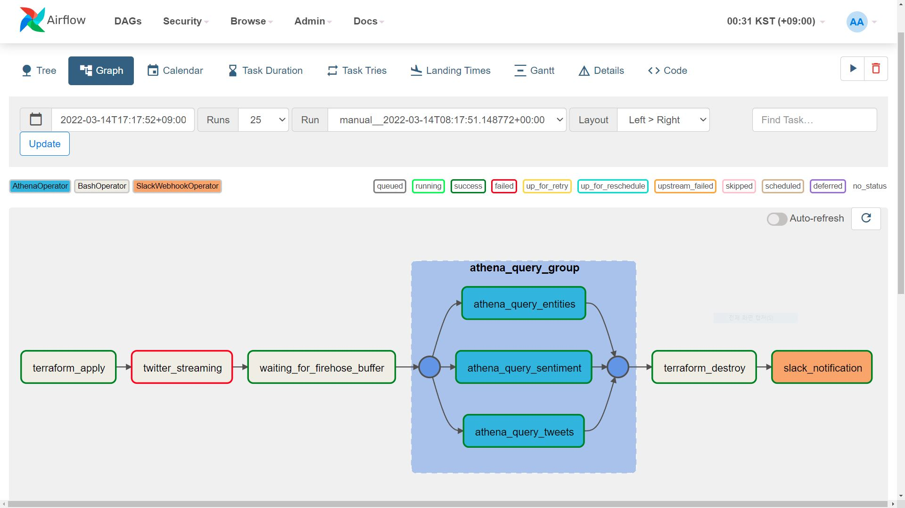
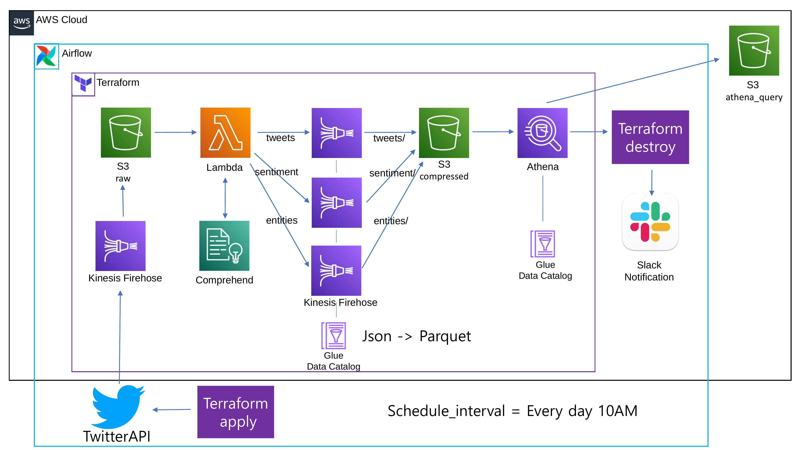
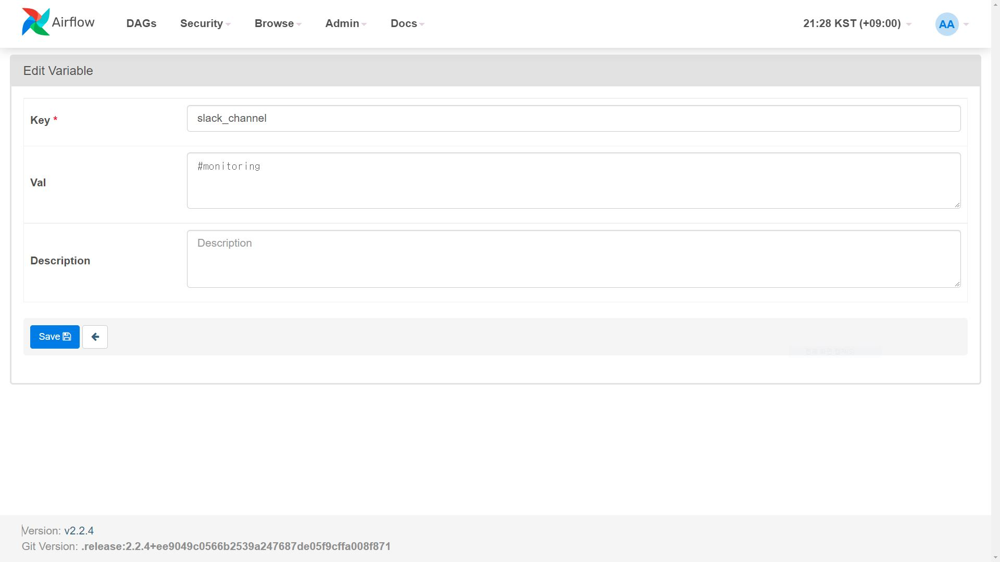
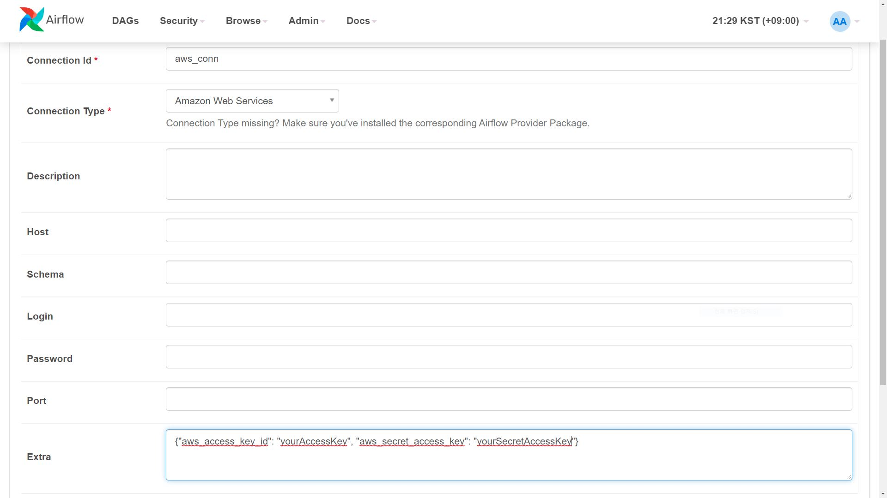
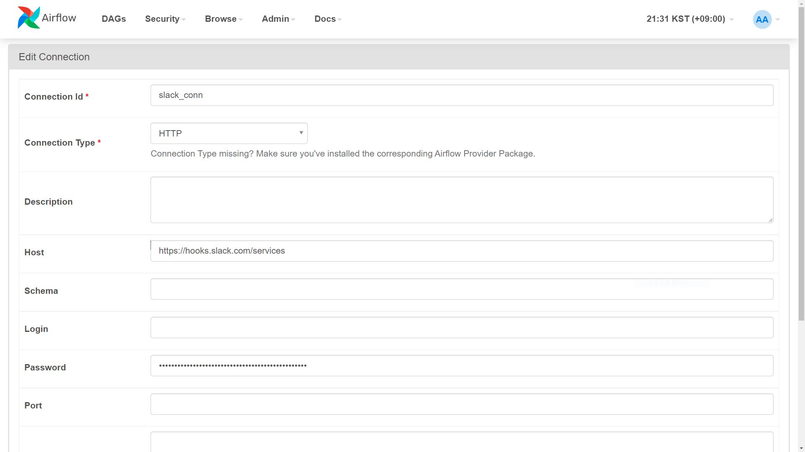
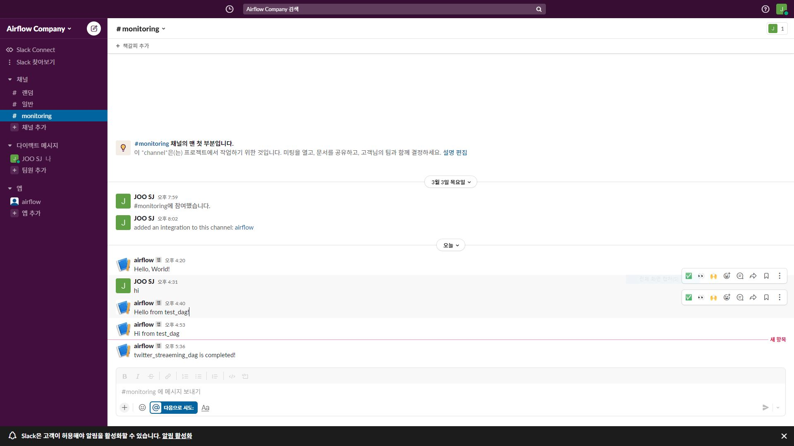

Airflow로 workflow를 스케쥴링하고 자동화하기
=============
---


---
<br/>

### 1. 아키텍쳐
   
   <br/>

   

   Project2의 아키텍쳐를 Airflow로 구성했어요. Quicksight는 제외했어요.

   작업이 완료되면 Slack에 메시지가 전송돼요.

   매일 오전 10시에 작업이 시작돼요.
<br/>
<br/>
<br/>
<br/> 

###  2. Airflow 설치
   
   <br/>

   ```
   docker-compose up -d
   docker ps
   docker exec -it -u root WorkerContainerID /bin/bash
   ```

  docker로 Airflow를 설치해요
  
  worker 컨테이너에서 작업을 진행해요

   ```
  settings/settings.sh

  #!/bin/bash
apt update && apt install unzip
# aws cli 설치
curl "https://awscli.amazonaws.com/awscli-exe-linux-x86_64.zip" -o "awscliv2.zip"
unzip awscliv2.zip
sudo ./aws/install
# terraform cli 설치
apt install software-properties-common -y
curl -fsSL https://apt.releases.hashicorp.com/gpg | sudo apt-key add -
apt-add-repository "deb [arch=amd64] https://apt.releases.hashicorp.com $(lsb_release -cs) main"
apt-get update && sudo apt-get install terraform
su airflow
   ```
   ./settings.sh로 aws cli와 terrafrom cli를 설치해요
   ```
   settings/settings2.sh

   #!/bin/bash
# tweepy 라이브러리 설치
pip install --upgrade pip && pip install tweepy
# aws credential 설정
aws configure set aws_access_key_id yourAccressKeyID
aws configure set aws_secret_access_key yourSecretAccessKey
aws configure set region ap-northeast-2
aws configure list
aws --version
rm -rf /opt/airflow/settings/awscliv2.zip
   ```
   ./settings2.sh로 tweepy 라이브러리를 설치하고 aws credential을 설정해요

<br/>
<br/>
<br/>
<br/> 

###  3. 변수, Connection 설정
   
   <br/>

   

   Variables에서 slack_channel - channel명을 입력해요.

   

   Connections에서 aws_conn - Extra에 aws credential을 입력해요.
   
   

   Connections에서 
   
   slack_conn - Host =https://hooks.slack.com/services

   Password = Slack의 WebHook URL 을 입력해요.
   
   ex) /T0******/B0*****

<br/>
<br/>
<br/>
<br/> 

###  4. Dag 실행
   
   <br/>

   ```
   dags/twitter_streaming_dag.py

from airflow.models.dag import DAG
from airflow.operators.bash import BashOperator
from airflow.operators.python import PythonOperator
from airflow.providers.amazon.aws.operators.athena import AthenaOperator
from airflow.exceptions import AirflowTaskTimeout
from task_group import athena_query_group
from airflow.contrib.operators.slack_webhook_operator import SlackWebhookOperator

from datetime import datetime, timedelta

default_args = {
  "owner":"juiceb",
  "start_date":datetime(2022, 3, 14),
  "depends_on_past": True
}

def _get_message() -> str:
  return "twitter_streaeming_dag is completed!"

with DAG('twitter_streaming_dag', schedule_interval="0 1 * * *", default_args=default_args, catchup=False) as dag:

  terraform_apply=BashOperator(task_id="terraform_apply", 
  bash_command="cd /opt/airflow/terraform && terraform init && terraform validate && terraform plan && terraform apply --auto-approve")

  twitter_streaming=BashOperator(task_id="twitter_streaming", 
  bash_command="cd /opt/airflow/dags/twitterAPIStreaming && python twitterAPIStreaming.py ",execution_timeout=timedelta(minutes=10))

  waiting_for_firehose_buffer=BashOperator(task_id="waiting_for_firehose_buffer", bash_command='sleep 300', trigger_rule="one_failed")

  athena_query_group=athena_query_group()

  terraform_destroy=BashOperator(task_id="terraform_destroy", bash_command="cd /opt/airflow/terraform && terraform destroy --auto-approve")

  slack_notification=SlackWebhookOperator(task_id="slack_notification", http_conn_id="slack_conn", message=_get_message(), 
  channel="{{ var.value.slack_channel }}")

  terraform_apply >> twitter_streaming >> waiting_for_firehose_buffer >> athena_query_group >> terraform_destroy >> slack_notification
   ```

   ```
   dags/task_group,py

   from airflow.models import DAG
from airflow.providers.amazon.aws.operators.athena import AthenaOperator
from airflow.utils.task_group import TaskGroup

query_tweets = "SELECT * FROM twitter_streaming_database.tweets limit 10"
query_sentiment = "SELECT * FROM twitter_streaming_database.tweet_sentiment limit 10"
query_entities = "SELECT * FROM twitter_streaming_database.tweet_entities limit 10"


def athena_query_group():
  with TaskGroup("athena_query_group") as athena_query_group:

    athena_query_tweets = AthenaOperator(
      task_id="athena_query_tweets", query=query_tweets,
      database="twitter_streaming_database", output_location="s3://juiceb-demo-athena/tweets",
      aws_conn_id="aws_conn"
    )

    athena_query_sentiment = AthenaOperator(
      task_id="athena_query_sentiment", query=query_sentiment, 
      database="twitter_streaming_database", output_location="s3://juiceb-demo-athena/sentiment",
      aws_conn_id="aws_conn"
    )

    athena_query_entities = AthenaOperator(
      task_id="athena_query_entities", query=query_entities, 
      database="twitter_streaming_database", output_location="s3://juiceb-demo-athena/entities",
      aws_conn_id="aws_conn"
    )

  return athena_query_group
   ```

   twitter_streaeming_dag를 실행해요.


<br/>
<br/>
<br/>
<br/> 

###  5. Airflow UI, Slack message 확인
   
   <br/>

   

   

   짜잔~ 멋진 3번째 프로젝트가 완성되었어요!

<br/>
<br/>
<br/>
<br/> 

참고 강의

https://www.udemy.com/course/the-ultimate-hands-on-course-to-master-apache-airflow/

https://www.udemy.com/course/apache-airflow-the-operators-guide/

그 외 공식 Documentation