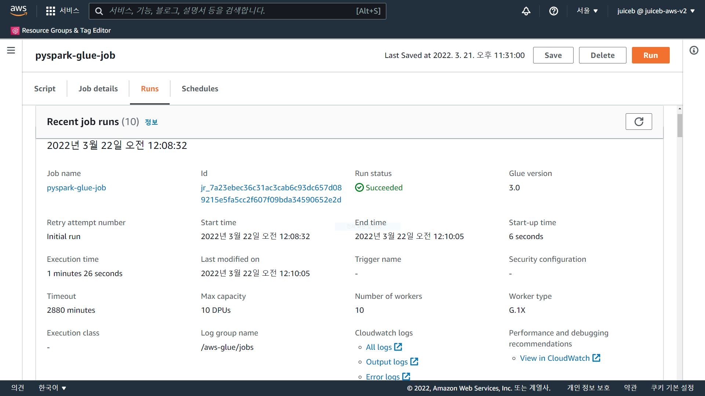
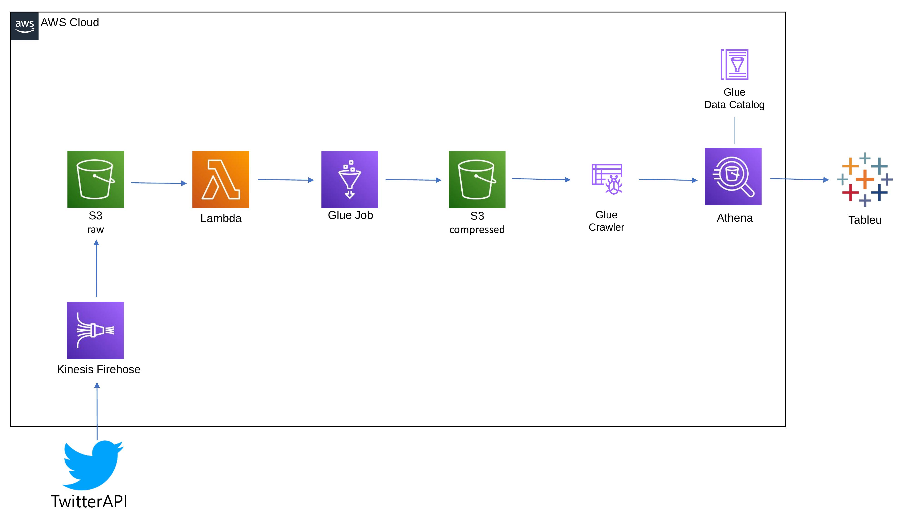
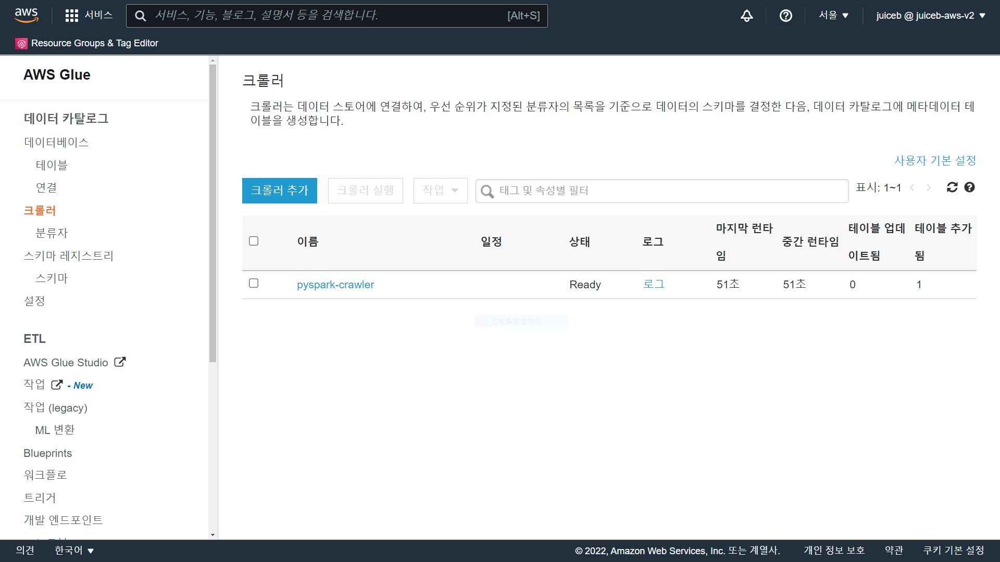
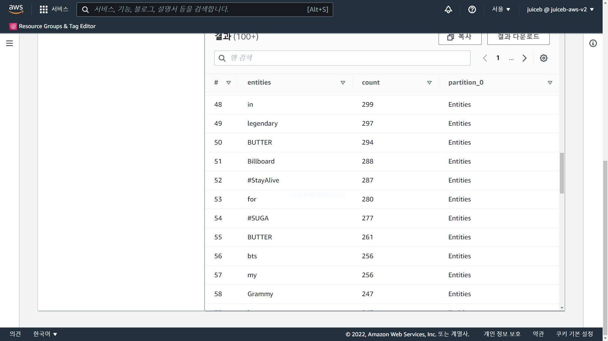

AWS Glue job script로 비정형 데이터 ETL하기
=============
---


---
<br/>

### 1. 아키텍쳐
   
   <br/>

   

   TwitterAPI로 비정형 데이터를 얻고 Kinesis Firehose를 통해 S3에 저장해요.

   Lambda로 Glue job을 트리거해요.

   변형된 데이터를 S3에 저장하고 크롤러로 테이블을 만들어요.

   테이블을 Athena로 쿼리하고 Tableua로 시각화해요.


<br/>
<br/>
<br/>
<br/> 

###  2. twitterAPI로 비정형 데이터 얻기
   
   <br/>

  twitterAPI로 얻은 트윗의 Text
  
  sample
  
   ```
  TUKANG SPILL TENTANG IDOL KOREA/TUKANG MANIPULASI DARI INDO YANG BERUBAH-UBAH IDENTITAS DAN MENYEBARKAN B…퓨마 엽서 일괄 양도 
택포 3.5
7명 멤버 모두 다 있습니다
방탄 방탄소년단 포카 포토카드 양도 판매 럭드 양도 남준 석진 지민 윤기 호석 태형 정국 맵솔 승허 봄날 드볼 엔오 윙즈 렌티큘러 프포 럽셀… https://t.co/MITNxO5TIFRT @Hongdo_Desert: 동료 4명이 코로나 확진...
자다가 전화받았더니 근무 바꿔줄 수 있냐고... 😭

코로나 정말 끝까지 이럴거야아!!!!🔥
...
   ```

   트윗의 내용을 형식을 지정하지 않고 수집해요.

   <br/>
<br/>
<br/>
<br/> 

###  3. Lambda로 Glue job 트리거하기
   
   <br/>

   ```
   lambda_function.py

   import json
import boto3

def lambda_handler(event, context):
    
    bucketName = event["Records"][0]["s3"]["bucket"]["name"]
    fileName = event["Records"][0]["s3"]["object"]["key"]
    
    print(bucketName, fileName,)
        
    glue = boto3.client('glue')

    response = glue.start_job_run(
        JobName = 'pyspark-glue-job',
        Arguments = {
            '--s3_target_path_key': fileName,
            '--s3_target_path_bucket': bucketName
        } 
    )
    
    return {
        'statusCode': 200,
        'body': json.dumps('Hello From Lambda!')
    }
   ```

   twitterAPI로 얻은 데이터를 firehose를 통해 S3에 저장해요.

   S3 ObjectCreated로 Lambda를 트리거해요.

   Lamdba로 Glue job을 실행시켜요.

<br/>
<br/>
<br/>
<br/> 

###  4. Glue job script로 ETL하기
   
   <br/>

   ```
  pyspark.py

  from awsglue.utils import getResolvedOptions
import sys
from pyspark import SparkConf, SparkContext
from pyspark.sql import SparkSession
from operator import add
from pyspark.sql.functions import col, regexp_extract, max, regexp_replace
from pyspark.sql.types import *

conf = SparkConf().setAppName("Spark RDD")
sc = SparkContext.getOrCreate(conf=conf)
spark = SparkSession.builder.appName("Spark DataFrame").getOrCreate()

args = getResolvedOptions(sys.argv,['s3_target_path_key','s3_target_path_bucket'])
bucket = args['s3_target_path_bucket']
fileName = args['s3_target_path_key']

inputFilePath = f"s3a://{bucket}/{fileName}"
finalFilePath = "s3a://pyspark-compressed-juiceb/Entities"

print(bucket, fileName)

schema = StructType([ StructField('rawEntities', StringType()),  StructField('Count' , IntegerType())])

rdd = sc.textFile(inputFilePath)
rdd = rdd.flatMap(lambda x: x.split(" ")).map(lambda x : (x.split(" ")[0], 1)).reduceByKey(add)
df = rdd.toDF(schema=('rawEntities string, Count int'))
df = df.withColumn("filtered_entities", regexp_extract(col("rawEntities"),'[^!:*.()\'ㅋ&—ㅡ’‘|"+,?-]+',0))
df = df.withColumn('Entities', regexp_replace(col("filtered_entities"), '^[ㄱ-ㅎ가-힣0-9A-za-z]$', ''))
df = df.filter(col("Entities") != "")
df = df.select("Entities","Count").groupBy("Entities").agg(max("Count").alias("Count"))
df.write.mode("append").parquet(finalFilePath)
   ```

   Lambda에서 S3버킷과 파일 이름을 가져와요.

   RDD로 파일을 읽고 flatMap으로 단어를 나눈 뒤 Count를 추가해요.

   DataFrame으로 바꾼 뒤 regexp_extract로 !,@," 같은 의미없는 데이터를 필터해요.

   regexp_replace로 한 글자짜리 데이터를 필터해요.

   필터된 데이터를 S3에 parquet로 저장해요. 

<br/>
<br/>
<br/>
<br/> 

###  5. Glue Crawler로 테이블을 만들기 

   <br/>

  

   크롤러를 실행하여 테이블을 만들어요.

   <br/>
<br/>
<br/>
<br/> 

###  6. Athena로 쿼리하기
   
   <br/>

   

   이모티콘은 생각을 못했네요!..


   <br/>
<br/>
<br/>
<br/> 

###  7. Tableua로 시각화하기
   
   <br/>

   <!--  -->

   준비중이예요.

   Tableua로 Athena에서 데이터셋을 가져오고 시각화해요.

   Glue job으로 ETL에 성공했어요!

<br/>
<br/>
<br/>
<br/> 

참고 강의

https://www.udemy.com/course/pyspark-developer-course/

https://www.udemy.com/course/pyspark-aws-master-big-data-with-pyspark-and-aws/

https://www.udemy.com/course/tableau-for-beginners/


그 외 공식 Documentation


---

### 여담

Glue job script를 작성할 때 막힌 적이 있었어요.

Databricks에서 테스트를 마친 코드였는데 에러가 나서 크게 좌절했죠.

구글링으로도 해결이 안되서 기대없이 Stack Overflow에 질문을 했어요.

https://stackoverflow.com/questions/71547278/can-i-convert-rdd-to-dataframe-in-glue/71547428#71547428

결국 답변에서 힌트를 얻고 해결하는데 성공했어요!