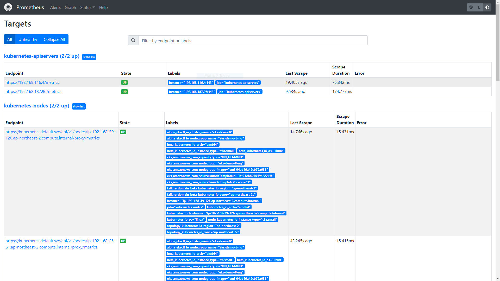
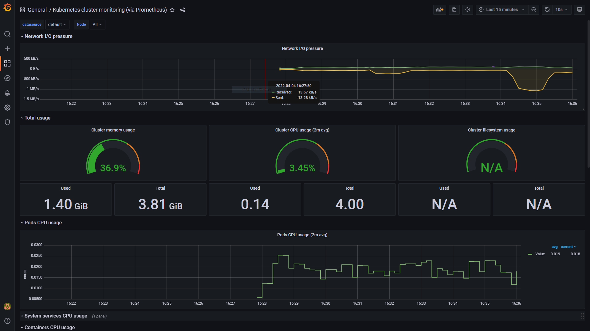
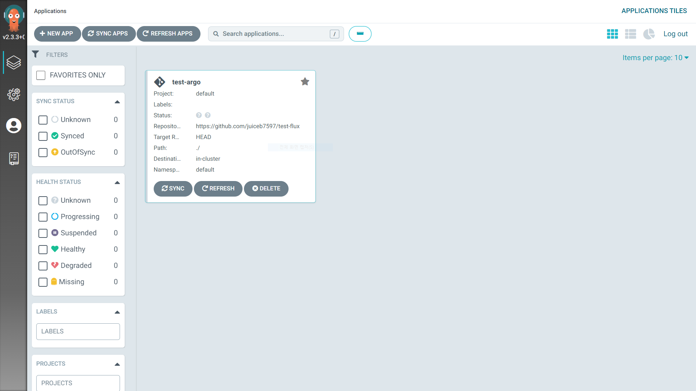

EKS로 Airflow 배포하기
=============
---


---
<br/>

### 1. 아키텍쳐
   
   <br/>

   

   작성중이예요. 수정될 수 있어요!


<br/>
<br/>
<br/>
<br/> 

###  2. EKS Cluster 만들기

   <br/>


   ```
   cluster.yml

   apiVersion: eksctl.io/v1alpha5
kind: ClusterConfig

metadata:
  name: airflow
  region: ap-northeast-2
  version: "1.21"

managedNodeGroups:
  - name: airflow-ng
    instanceType: t3.medium
    privateNetworking: true
    minSize: 2
    maxSize: 4
    desiredCapacity: 2
    volumeSize: 20
    ssh:
      allow: true
      publicKeyName: YourClusterKeypair
    labels: { role: worker }
    tags:
      nodegroup-role: worker
    iam:
      withAddonPolicies:
        ebs: true
        imageBuilder: true
        efs: true
        albIngress: true
        autoScaler: true
        cloudWatch: true
   ```
   
   ```
   eksctl create cluster -f cluster.yaml
   eksctl utils associate-iam-oidc-provider --cluster airflow --approve
   ```
   
   노드그룹과 함께 EKS 클러스터를 만들어요.
   
   오토스케일링과 ALB 권한도 추가해요.

   추가로 클러스터에 oidc 자격 증명 공급자를 생성해요.
  
<br/>
<br/>
<br/>
<br/> 

###  3. Cluster Autoscaler, ALB-Controller, Fluentbit 설정
   
   <br/>
   
   ```
   https://docs.aws.amazon.com/ko_kr/eks/latest/userguide/autoscaling.html

   curl -o cluster-autoscaler-autodiscover.yaml https://raw.githubusercontent.com/kubernetes/autoscaler/master/cluster-autoscaler/cloudprovider/aws/examples/cluster-autoscaler-autodiscover.yaml
YourClusterName
kubectl apply -f cluster-autoscaler-autodiscover.yaml
kubectl -n kube-system annotate deployment.apps/cluster-autoscaler cluster-autoscaler.kubernetes.io/safe-to-evict="false" 
kubectl -n kube-system edit deployment.apps/cluster-autoscaler
--balance-similar-node-groups
--skip-nodes-with-system-pods=false
kubectl set image deployment cluster-autoscaler -n kube-system cluster-autoscaler=k8s.gcr.io/autoscaling/cluster-autoscaler:v1.21.2
  ```
  
Pod 수에 따라 노드가 추가되게끔 오토스케일러를 설정해요.

```
https://docs.aws.amazon.com/ko_kr/eks/latest/userguide/aws-load-balancer-controller.html

helm repo add eks https://aws.github.io/eks-charts
helm install aws-load-balancer-controller eks/aws-load-balancer-controller --set clusterName=yourClusterName -n kube-system
```

ALB-Controller를 배포해요 이후 Ingress를 사용할 거예요.

<br/>
<br/>
<br/>
<br/> 

###  4. Flux 배포
   
   <br/>
   
```
flux check --pre
flux bootstrap github \
  --owner=yourGithubUsername \
  --repository=yourGithubRepo \
  --path=example/cluster \
  --personal
```

flux check로 실행해도 되는지 확인해요.

클러스터에 flux를 배포해요.

<br/>
<br/>
<br/>
<br/> 

###  5. Prometheus, Grafana 설치 후 연동
   
   <br/>

   ```
prometheus/helm-release-prometheus.yaml

  apiVersion: helm.toolkit.fluxcd.io/v2beta1
kind: HelmRelease
metadata:
  name: prometheus
  namespace: prometheus
spec:
  chart:
    spec:
      chart: prometheus
      sourceRef:
        kind: HelmRepository
        name: prometheus-community
      version: 15.8.0
  interval: 5m0s
   ```

  ```
  kubectl --namespace=prometheus port-forward deploy/prometheus-server 9090
  ```

   UI에서 Target을 확인해요.

      

   ---
<br/>

   ```
   grafana/helm-release-grafana.yaml

apiVersion: helm.toolkit.fluxcd.io/v2beta1
kind: HelmRelease
metadata:
  name: grafana
  namespace: grafana
spec:
  chart:
    spec:
      chart: grafana
      sourceRef:
        kind: HelmRepository
        name: grafana
      version: 6.25.1
  interval: 5m0s
   ```


   ```
kubectl port-forward service/grafana 3000:80 -n grafana

configuration - datasources - prometheus - url service/prometheus-server_cluster-IP:port - save & test
create - import - 13770 load
   ```

 UI에서 데이터소스로 Prometheus를 설정해요.

   원하는 대쉬보드로 클러스터를 모니터링해요.

      

<br/>
<br/>
<br/>
<br/> 

###  6. Airflow 배포
   
   <br/>

   ```
   helm install airflow apache-airflow/airflow --version 1.5.0 \
   --namespace airflow --create-namespace --values ./values.yaml
   ```

   ```
   values.yaml

   fernetKey: "mWKHnpIaV5zRMDshi6VFmtkJf5w5bVSx5GH_Ds8rYoA="
env:
  - name: "AIRFLOW__KUBERNETES__DAGS_IN_IMAGE"
    value: "False"
  - name: "AIRFLOW__KUBERNETES__NAMESPACE"
    value: "airflow"
  - name: "AIRFLOW__KUBERNETES__WORKER_CONTAINER_REPOSITORY"
    value: "apache/airflow"
  - name: "AIRFLOW__KUBERNETES__WORKER_CONTAINER_TAG"
    value: "1.10.10.1-alpha2-python3.7"
  - name: "AIRFLOW__KUBERNETES__RUN_AS_USER"
    value: "50000"
  - name: "AIRFLOW__CORE__LOAD_EXAMPLES"
    value: "False"
executor: "KubernetesExecutor"
dags:
  persistence:
    enabled: false
gitSync:
  enabled: true
  repo: https://github.com/username/yourGithubRepo.git
  branch: main
  maxFailures: 0
  subPath: ""
  wait: 60
   ```

  helm cli로 values 값과 함께 배포해요.

  airflow 폴더는 참고용으로 넣어뒀어요.

  <br/>
<br/>
<br/>
<br/> 

###  7. 작성중
   
   <br/>

   ```

   ```


<br/>
<br/>
<br/>
<br/> 

참고 강의

https://www.udemy.com/course/rocking-kubernetes-with-amazon-eks-fargate-and-devops/

https://www.udemy.com/course/apache-airflow-on-aws-eks-the-hands-on-guide/

그 외 공식 Documentation


---

### 선택사항

<br/>
<br/>

1. NetworkPolicyProvider(agent) - calion

```
https://docs.aws.amazon.com/ko_kr/eks/latest/userguide/calico.html

helm repo add projectcalico https://docs.projectcalico.org/charts
helm install calico projectcalico/tigera-operator --version v3.21.4
kubectl get all -n tigera-operator
kubectl port-forward service/management-ui -n management-ui 9001
```

포드간 연결을 제어할 경우 NetworkPolicyProvider를 설치해요.

  <br/>

2. kubecost

```
https://www.kubecost.com/install#show-instructions

kubectl create namespace kubecost
helm repo add kubecost https://kubecost.github.io/cost-analyzer/
helm install kubecost kubecost/cost-analyzer --namespace kubecost --set kubecostToken="ZHNhZGFzZGFkc0Bhc2RzZGE=xm343yadf98"
kubectl port-forward --namespace kubecost deployment/kubecost-cost-analyzer 9090
```

비용을 관리하고 싶을 때 kubecost를 설치해요.


  <br/>

3. Argo

```
https://argo-cd.readthedocs.io/en/stable/getting_started/

kubectl create namespace argocd
kubectl apply -n argocd -f https://raw.githubusercontent.com/argoproj/argo-cd/stable/manifests/install.yaml
choco install argocd-cli
kubectl port-forward svc/argocd-server -n argocd 8080:443
kubectl -n argocd get secret argocd-initial-admin-secret -o jsonpath="{.data.password}"
ID=admin, Password=decoded~~
newApp-project:defalt-RepogitoryURL:githubRepo-path:./-ClusterURL=https://kubernetes.default.svc-Namespace:default
Sync
```

Flux대신 Argo를 사용할 때 설치해요.




