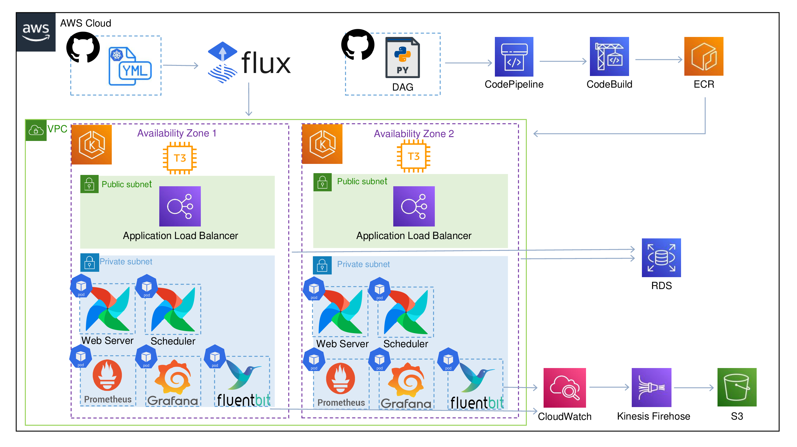
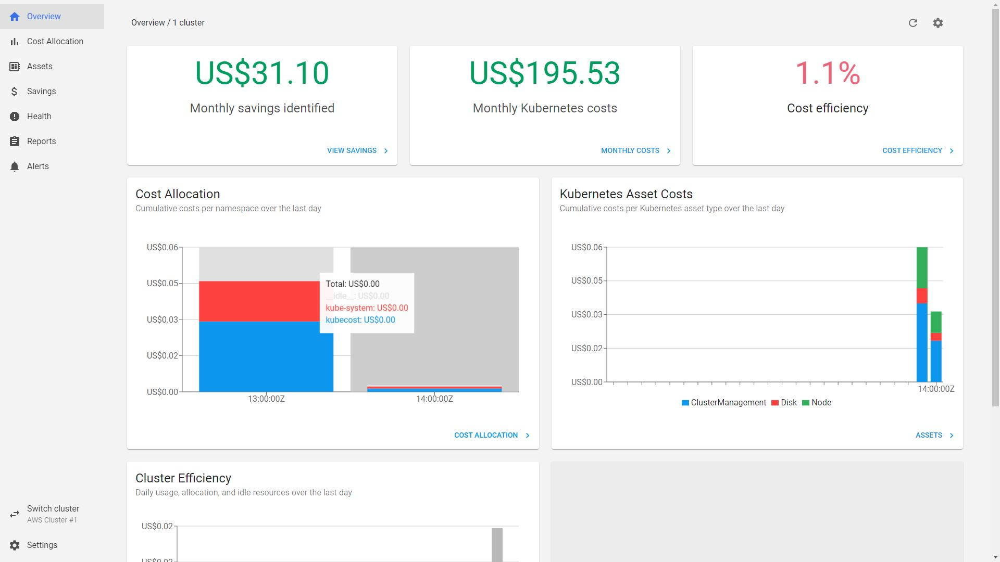

EKS로 Airflow 배포하기
=============
---



---
<br/>

### 1. 아키텍쳐
   
   <br/>

   

   수정될 수 있어요!


<br/>
<br/>
<br/>
<br/> 

###  2. EKS Cluster 만들기

   <br/>

   ```
   eksctl create cluster --name yourClusterName \
   --version=1.21 \
   --node-type=t3.small \
   --nodegroup-name yourNodegroupName \
  --nodes-max=6 \
  --ssh-access \
  --ssh-public-key=yourKeyPair \
  --asg-access \
  --external-dns-access \
  --alb-ingress-access
eksctl utils associate-iam-oidc-provider --cluster yourClusterName --approve
   ```
   
   노드그룹과 함께 EKS 클러스터를 만들어요.
   
   오토스케일링과 ALB 권한도 추가해요.

   추가로 클러스터에 oidc 자격 증명 공급자를 생성해요.
  
<br/>
<br/>
<br/>
<br/> 

###  3. Cluster Autoscaler, ALB-Controller 설정
   
   <br/>
   
   ```
   curl -o cluster-autoscaler-autodiscover.yaml https://raw.githubusercontent.com/kubernetes/autoscaler/master/cluster-autoscaler/cloudprovider/aws/examples/cluster-autoscaler-autodiscover.yaml
YourClusterName
kubectl apply -f cluster-autoscaler-autodiscover.yaml
kubectl -n kube-system annotate deployment.apps/cluster-autoscaler cluster-autoscaler.kubernetes.io/safe-to-evict="false" 
kubectl -n kube-system edit deployment.apps/cluster-autoscaler
--balance-similar-node-groups
--skip-nodes-with-system-pods=false
kubectl set image deployment cluster-autoscaler -n kube-system cluster-autoscaler=k8s.gcr.io/autoscaling/cluster-autoscaler:v1.21.2
  ```
  https://docs.aws.amazon.com/ko_kr/eks/latest/userguide/autoscaling.html

Pod 수에 따라 노드가 추가되게끔 오토스케일러를 설정해요.

```
helm repo add eks https://aws.github.io/eks-charts
helm install aws-load-balancer-controller eks/aws-load-balancer-controller --set clusterName=yourClusterName -n kube-system
```
https://docs.aws.amazon.com/ko_kr/eks/latest/userguide/aws-load-balancer-controller.html

ALB-Controller를 배포해요 이후 Ingress를 사용할 거예요.

<br/>
<br/>
<br/>
<br/> 

###  4. Prometheus, Grafana 설치 후 연동
   
   <br/>

   ```
   prometheus
kubectl create namespace prometheus
helm repo add prometheus-community https://prometheus-community.github.io/helm-charts
helm upgrade -i prometheus prometheus-community/prometheus --namespace prometheus --set alertmanager.persistentVolume.storageClass="gp2",server.persistentVolume.storageClass="gp2"
kubectl --namespace=prometheus port-forward deploy/prometheus-server 9090
   ```
   Prometheus를 helm으로 설치해요.

   UI에서 Target을 확인해요.

      


   ```
grafana.yaml type:ClusterIP
kubectl create ns grafana
kubectl apply -f grafana.yaml -n grafana
kubectl port-forward service/grafana 3000:3000 -n grafana
configuration - datasources - prometheus - url service/prometheus-server_cluster-IP:port - save & test
create - import - 13770 load - 
   ```
   https://grafana.com/docs/grafana/latest/installation/kubernetes/

   grafana.yaml 파일의 type을 NodePort에서 ClusterIP로 수정해요.

   UI에서 데이터소스로 Prometheus를 설정해요.

   원하는 대쉬보드로 모니터링해요.

      

<br/>
<br/>
<br/>
<br/> 

###  6. 작성중
   
   <br/>

  작성중이예요.

  <br/>
<br/>
<br/>
<br/> 

참고 강의

https://www.udemy.com/course/rocking-kubernetes-with-amazon-eks-fargate-and-devops/

https://www.udemy.com/course/apache-airflow-on-aws-eks-the-hands-on-guide/

그 외 공식 Documentation


---

### 선택사항

1. NetworkPolicyProvider(agent) - calion

```
helm repo add projectcalico https://docs.projectcalico.org/charts
helm install calico projectcalico/tigera-operator --version v3.21.4
kubectl get all -n tigera-operator
kubectl port-forward service/management-ui -n management-ui 9001
```

https://docs.aws.amazon.com/ko_kr/eks/latest/userguide/calico.html

포드간 연결을 제어할 경우 NetworkPolicyProvider를 설치해요.

  <br/>

2. kubecost

```
kubectl create namespace kubecost
helm repo add kubecost https://kubecost.github.io/cost-analyzer/
helm install kubecost kubecost/cost-analyzer --namespace kubecost --set kubecostToken="ZHNhZGFzZGFkc0Bhc2RzZGE=xm343yadf98"
kubectl port-forward --namespace kubecost deployment/kubecost-cost-analyzer 9090
```

https://www.kubecost.com/install#show-instructions

비용을 관리하고 싶을 때 kubecost를 설치해요.



  <br/>

3. Argo

```
kubectl create namespace argocd
kubectl apply -n argocd -f https://raw.githubusercontent.com/argoproj/argo-cd/stable/manifests/install.yaml
choco install argocd-cli
kubectl port-forward svc/argocd-server -n argocd 8080:443
kubectl -n argocd get secret argocd-initial-admin-secret -o jsonpath="{.data.password}"
ID=admin, Password=decoded~~
newApp-project:defalt-RepogitoryURL:githubRepo-path:./-ClusterURL=https://kubernetes.default.svc-Namespace:default
Sync
```

https://argo-cd.readthedocs.io/en/stable/getting_started/

Flux대신 Argo를 사용할 때 설치해요.


